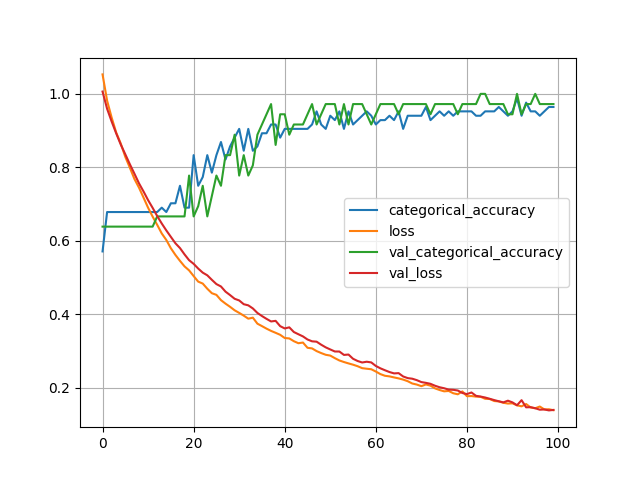
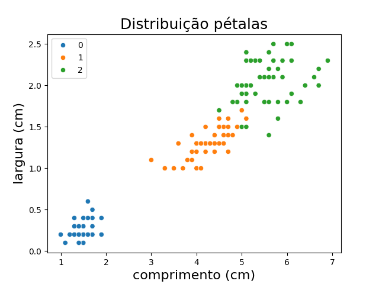
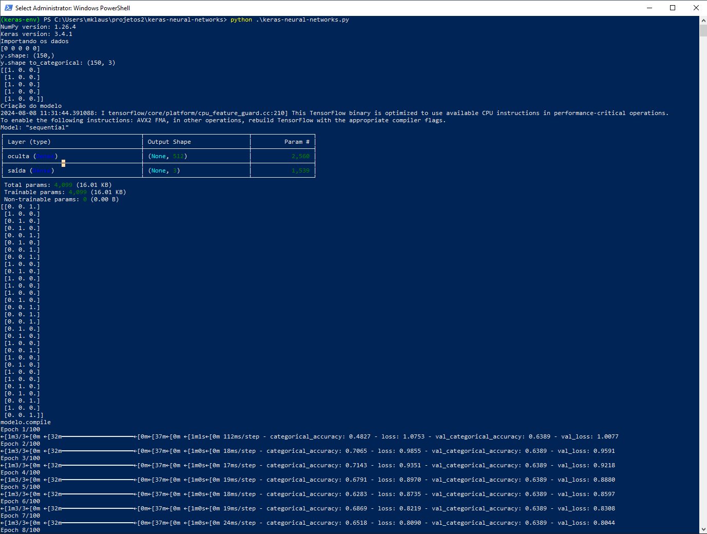

## General Notes

This repository contains a Keras implementation of a Multi-Layer Perceptron (MLP) neural network model. You can find code for:

* Data preparation and preprocessing
* Model creation and compilation
* Training and evaluation
* Saving and loading the model

## Visualization of Results

Here are some visualizations of the model's performance:

* **Loss and Accuracy:**
  

* **Data Distribution:**
  

* **Model Architecture:**
  

## How to Run

1. Install the required libraries: `pip install tensorflow keras matplotlib scikit-learn`
2. Run the `train.py` script to train the model.
3. Run the `predict.py` script to make predictions with the saved model.

## Contributing

Contributions are welcome! Please submit pull requests or issues if you have any improvements or suggestions.
